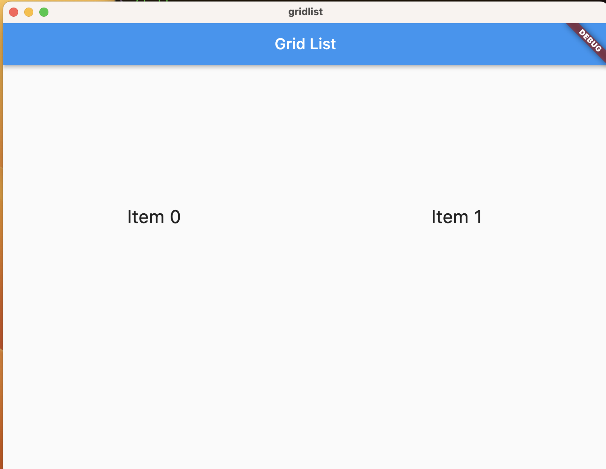
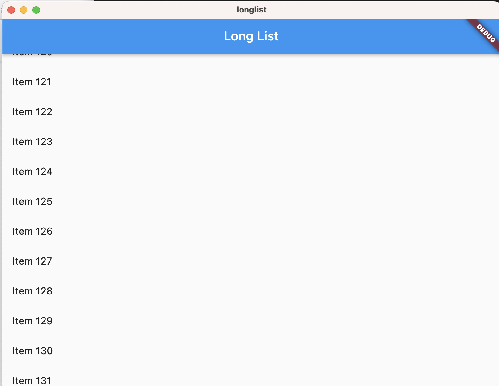
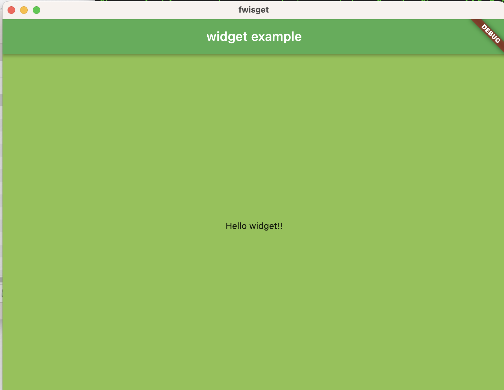

# Flutter

### 1. Hello world app

\#flutter create helloworld

\#cd helloworld

\#flutter doctor -v

\#flutter run

- first remove all 
- then use code:
    
        import 'package:flutter/material.dart';
 
        void main() {
        runApp(const HelloWorld());
        }
 
        class HelloWorld extends StatelessWidget {
        const HelloWorld({Key? key}) : super(key: key);
 
        @override
        Widget build(BuildContext context) {
         return const MaterialApp(
          home: Center(child: Text('Hello World')),
          );
         }
        }

**And what is Stateless Widget? **

A widget is either stateful or stateless. If a widget can change—when a user interacts with it, for example—it's stateful. A stateless widget never changes. Icon , IconButton , and Text are examples of stateless widgets.

Link for read: [Add interactivity to your Flutter app](https://docs.flutter.dev/ui/interactivity)

So, replace the code in main.dart

    import 'package:flutter/material.dart';

     void main() {
     runApp(const HelloWorld());
    }

    class HelloWorld extends StatelessWidget {
    const HelloWorld({Key? key}) : super(key: key);

    @override
    Widget build(BuildContext context) {
	// Material App
	return MaterialApp(

		// Scaffold Widget
		home: Scaffold(
	appBar: AppBar(
		// AppBar takes a Text Widget
		// in it's title parameter
		title: const Text('Hello World!'),
	  ),
	   body: const Center(child: Text('Hello World!')),
	    ));
    }
    }

Now it's better!

**And what is class in flutter(dart)?**

Class is a blueprint for an object. That is, a class describes an object that you can create. The object itself is what holds any specific data and logic.

Link for read: [Classes](https://flutterbyexample.com/lesson/classes)

**And what is naming convebtion in flutter(dart)?**

for read:

[flutter style guide](https://github.com/flutter/flutter/wiki/Style-guide-for-Flutter-repo#introduction)

[dart style guide](https://dart.dev/effective-dart/style)

**And what is object principals in flutter(dart)?**

Object principles:

* abstraction
* inheritance
* encapsulation
* polymorphism

for read:

[object principles](https://khalilstemmler.com/articles/object-oriented/programming/4-principles/)

[S.O.L.I.D](https://medium.com/nerd-for-tech/solid-principles-in-a-flutter-32eaf7218476)

[dart object principles](https://blog.albertobonacina.com/object-oriented-programming-principles-in-dart)

### 2. List wiev app

- Simple List

        import 'package:flutter/material.dart';

        void main() => runApp(const MyApp());
 
        class MyApp extends StatelessWidget {
        const MyApp({super.key});

        @override
        Widget build(BuildContext context) {
        const title = 'Basic List';

        return MaterialApp(
        title: title,
        home: Scaffold(
        appBar: AppBar(
          title: const Text(title),
        ),
        body: ListView(
          children: const <Widget>[
            ListTile(
              leading: Icon(Icons.map),
              title: Text('Map'),
            ),
            ListTile(
              leading: Icon(Icons.photo_album),
              title: Text('Album'),
            ),
            ListTile(
              leading: Icon(Icons.phone),
              title: Text('Phone'),
              ),
             ],
            ),
           ),
          );
         }
        }
        
        
 
 
 
 
**What is flutter widget?**

Widgets are the central class hierarchy in the Flutter framework. A widget is an immutable description of part of a user interface. Widgets can be inflated into elements, which manage the underlying render tree.

for read:  [widget](https://api.flutter.dev/flutter/widgets/Widget-class.html)

**And what  is a flutter?**

Flutter is an open source framework developed and supported by Google. Frontend and full-stack developers use Flutter to build an application's user interface (UI) for multiple platforms with a single codebase.

- Horizontal List

        import 'package:flutter/material.dart';

        void main() => runApp(const MyApp());

        class MyApp extends StatelessWidget {
        const MyApp({super.key});

        @override
        Widget build(BuildContext context) {
        const title = 'Horizontal List';

        return MaterialApp(
        title: title,
        home: Scaffold(
        appBar: AppBar(
          title: const Text(title),
        ),
        body: Container(
          margin: const EdgeInsets.symmetric(vertical: 20),
          height: 200,
          child: ListView(
            // This next line does the trick.
            scrollDirection: Axis.horizontal,
            children: <Widget>[
              Container(
                width: 160,
                color: Colors.red,
              ),
              Container(
                width: 160,
                color: Colors.blue,
              ),
              Container(
                width: 160,
                color: Colors.green,
              ),
              Container(
                width: 160,
                color: Colors.yellow,
              ),
              Container(
                width: 160,
                color: Colors.orange,
                  ),
                ],
              ),
             ),
            ),
          );
         }
        }

 

**What is Scaffold class?**

Scaffold is a class in flutter which provides many widgets or we can say APIs like Drawer, Snack-Bar, Bottom-Navigation-Bar, Floating-Action-Button, App-Bar, etc. Scaffold will expand or occupy the whole device screen. It will occupy the available space. Scaffold will provide a framework to implement the basic material design layout of the application. 

for read:
[Scaffold](https://www.geeksforgeeks.org/scaffold-class-in-flutter-with-examples/)

- grid list

        import 'package:flutter/material.dart';

			void main() {
 			    runApp(const MyApp());
			}

		class MyApp extends StatelessWidget {
		const MyApp({super.key});

  		@override
 		Widget build(BuildContext context) {
    	const title = 'Grid List';

		    return MaterialApp(
		      title: title,
		      home: Scaffold(
		        appBar: AppBar(
		          title: const Text(title),
		        ),
		        body: GridView.count(
		          // Create a grid with 2 columns. If you change the scrollDirection to
		          // horizontal, this produces 2 rows.
		          crossAxisCount: 2,
		          // Generate 100 widgets that display their index in the List.
		          children: List.generate(100, (index) {
		            return Center(
		              child: Text(
		                'Item $index',
		                style: Theme.of(context).textTheme.headlineSmall,
		              ),
		            );
		          }),
		        ),
		      ),
		    );
		  }
		}

     
     
     
     
     
     
 
 
 
 
 
 - lists with different types of items
 
 
 
 
				 import 'package:flutter/material.dart';
				
				void main() {
				  runApp(
				    MyApp(
				      items: List<ListItem>.generate(
				        1000,
				        (i) => i % 6 == 0
				            ? HeadingItem('Heading $i')
				            : MessageItem('Sender $i', 'Message body $i'),
				      ),
				    ),
				  );
				}
				
				class MyApp extends StatelessWidget {
				  final List<ListItem> items;
				
				  const MyApp({super.key, required this.items});
				
				  @override
				  Widget build(BuildContext context) {
				    const title = 'Mixed List';
				
				    return MaterialApp(
				      title: title,
				      home: Scaffold(
				        appBar: AppBar(
				          title: const Text(title),
				        ),
				        body: ListView.builder(
				          // Let the ListView know how many items it needs to build.
				          itemCount: items.length,
				          // Provide a builder function. This is where the magic happens.
				          // Convert each item into a widget based on the type of item it is.
				          itemBuilder: (context, index) {
				            final item = items[index];
				
				            return ListTile(
				              title: item.buildTitle(context),
				              subtitle: item.buildSubtitle(context),
				            );
				          },
				        ),
				      ),
				    );
				  }
				}
				
				/// The base class for the different types of items the list can contain.
				abstract class ListItem {
				  /// The title line to show in a list item.
				  Widget buildTitle(BuildContext context);
				
				  /// The subtitle line, if any, to show in a list item.
				  Widget buildSubtitle(BuildContext context);
				}
				
				/// A ListItem that contains data to display a heading.
				class HeadingItem implements ListItem {
				  final String heading;
				
				  HeadingItem(this.heading);
				
				  @override
				  Widget buildTitle(BuildContext context) {
				    return Text(
				      heading,
				      style: Theme.of(context).textTheme.headlineSmall,
				    );
				  }
				
				  @override
				  Widget buildSubtitle(BuildContext context) => const SizedBox.shrink();
				}
				
				/// A ListItem that contains data to display a message.
				class MessageItem implements ListItem {
				  final String sender;
				  final String body;
				
				  MessageItem(this.sender, this.body);
				
				  @override
				  Widget buildTitle(BuildContext context) => Text(sender);
				
				  @override
				  Widget buildSubtitle(BuildContext context) => Text(body);
	         }
	 
 
    
    
    
      
   
   
   
   
   
   
   
   -   Spaced list

   
			   import 'package:flutter/material.dart';
			
			void main() => runApp(const SpacedItemsList());
			
			class SpacedItemsList extends StatelessWidget {
			  const SpacedItemsList({super.key});
			
			  @override
			  Widget build(BuildContext context) {
			    const items = 4;
			
			    return MaterialApp(
			      title: 'Flutter Demo',
			      debugShowCheckedModeBanner: false,
			      theme: ThemeData(
			        colorScheme: ColorScheme.fromSeed(seedColor: Colors.deepPurple),
			        cardTheme: CardTheme(color: Colors.blue.shade50),
			        useMaterial3: true,
			      ),
			      home: Scaffold(
			        body: LayoutBuilder(builder: (context, constraints) {
			          return SingleChildScrollView(
			            child: ConstrainedBox(
			              constraints: BoxConstraints(minHeight: constraints.maxHeight),
			              child: Column(
			                mainAxisAlignment: MainAxisAlignment.spaceBetween,
			                crossAxisAlignment: CrossAxisAlignment.stretch,
			                children: List.generate(
			                    items, (index) => ItemWidget(text: 'Item $index')),
			              ),
			            ),
			          );
			        }),
			      ),
			    );
			  }
			}
			
			class ItemWidget extends StatelessWidget {
			  const ItemWidget({
			    super.key,
			    required this.text,
			  });
			
			  final String text;
			
			  @override
			  Widget build(BuildContext context) {
			    return Card(
			      child: SizedBox(
			        height: 100,
			        child: Center(child: Text(text)),
			      ),
			    );
		  					}
						}
						
						
     
   
   
   
   
   
   - long list

   			import 'package:flutter/material.dart';

			void main() {
			  runApp(
			    MyApp(
			      items: List<String>.generate(10000, (i) => 'Item $i'),
			    ),
			  );
			}
			
			class MyApp extends StatelessWidget {
			  final List<String> items;
			
			  const MyApp({super.key, required this.items});
			
			  @override
			  Widget build(BuildContext context) {
			    const title = 'Long List';
			
			    return MaterialApp(
			      title: title,
			      home: Scaffold(
			        appBar: AppBar(
			          title: const Text(title),
			        ),
			        body: ListView.builder(
			          itemCount: items.length,
			          prototypeItem: ListTile(
			            title: Text(items.first),
			          ),
			          itemBuilder: (context, index) {
			            return ListTile(
			              title: Text(items[index]),
			            );
			          },
			        ),
			      ),
			    );
			    }
			    }
			    
			    
			    
     
   
   
   
   
   
   Codelab
   
[Write Your First Flutter App, part 1](https://codelabs.flutter-io.cn/codelabs/first-flutter-app-pt1/index.html#0)

[Write Your First Flutter App, part 2](https://codelabs.flutter-io.cn/codelabs/first-flutter-app-pt2/index.html#0)

### 3. Widget explained

for read: [Building user interfaces with Flutter](https://docs.flutter.dev/ui)

**Basic widget:**

***Text***
    The Text widget lets you create a run of styled text within your application.
    
   [Text Class](https://api.flutter.dev/flutter/widgets/Text-class.html)
    
***Row, Column***
    These flex widgets let you create flexible layouts in both the horizontal (Row) and vertical (Column) directions. The design of these objects is based on the web’s flexbox layout model.
    
   [Row Class](https://api.flutter.dev/flutter/widgets/Row-class.html)
    
   [Column Class](https://api.flutter.dev/flutter/widgets/Column-class.html)
    
    
    
***Stack***
    Instead of being linearly oriented (either horizontally or vertically), a Stack widget lets you place widgets on top of each other in paint order. You can then use the Positioned widget on children of a Stack to position them relative to the top, right, bottom, or left edge of the stack. Stacks are based on the web’s absolute positioning layout model.
    
   [Stack Class](https://api.flutter.dev/flutter/widgets/Stack-class.html)
    
Container
    The Container widget lets you create a rectangular visual element. A container can be decorated with a BoxDecoration, such as a background, a border, or a shadow. A Container can also have margins, padding, and constraints applied to its size. In addition, a Container can be transformed in three-dimensional space using a matrix.  
    
   [Container Class](https://api.flutter.dev/flutter/widgets/Container-class.html)
   
   
   example 1:
   	import 'package:flutter/material.dart';

	void main() {
	  runApp(
	    const MaterialApp(
	      title: 'Flutter Tutorial',
	      home: TutorialHome(),
	    ),
	  );
	}

	class TutorialHome extends StatelessWidget {
	  const TutorialHome({super.key});
	
	  @override
	  Widget build(BuildContext context) {
	    // Scaffold is a layout for
	    // the major Material Components.
	    return Scaffold(
	      appBar: AppBar(
	        leading: const IconButton(
	          icon: Icon(Icons.menu),
	          tooltip: 'Navigation menu',
	          onPressed: null,
	        ),
	        title: const Text('Example title'),
	        actions: const [
	          IconButton(
	            icon: Icon(Icons.search),
	            tooltip: 'Search',
	            onPressed: null,
	          ),
	        ],
	      ),
	      // body is the majority of the screen.
	      body: const Center(
	        child: Text('Hello, world!'),
	      ),
	      floatingActionButton: const FloatingActionButton(
	        tooltip: 'Add', // used by assistive technologies
	        onPressed: null,
	        child: Icon(Icons.add),
	      ),
	    );
	  }
	}
	   
   
   
       
   
   
 
 
 
   
   
  **Widgets:** Each element on a screen of the Flutter app is a widget. The view of the screen completely depends upon the choice and sequence of the widgets used to build the apps. And the structure of the code of an apps is a tree of widgets. 
   
   

Category of Widgets:

There are mainly 14 categories in which the flutter widgets are divided. They are mainly segregated on the basis of the functionality they provide in a flutter application.

1.  Accessibility: These are the set of widgets that make a flutter app more easily accessible.
2. Animation and Motion: These widgets add animation to other widgets.
    Assets, Images, and Icons: These widgets take charge of assets such as display images and show icons.
    Async: These provide async functionality in the flutter application.
    Basics: These are the bundle of widgets that are absolutely necessary for the development of any flutter application.
    Cupertino: These are the iOS designed widgets.
    Input: This set of widgets provides input functionality in a flutter application.
    Interaction Models: These widgets are here to manage touch events and route users to different views in the application.
    Layout: This bundle of widgets helps in placing the other widgets on the screen as needed.
    Material Components: This is a set of widgets that mainly follow material design by Google.
    Painting and effects: This is the set of widgets that apply visual changes to their child widgets without changing their layout or shape.
    Scrolling: This provides scrollability of to a set of other widgets that are not scrollable by default.
    Styling: This deals with the theme, responsiveness, and sizing of the app.
    Text: This displays text.

 Types of Widgets:

There are broadly two types of widgets in the flutter:   
   
      
   
   
   
   
	import 'package:flutter/material.dart';
	
	void main() => runApp(const MyApp());
	
	class MyApp extends StatefulWidget {
	const MyApp({Key? key}) : super(key: key);
	
	@override
	// ignore: library_private_types_in_public_api
	_MyAppState createState() => _MyAppState();
	}
	
	class _MyAppState extends State<MyApp> {
	@override
	Widget build(BuildContext context) {
		return MaterialApp(
		home: Scaffold(
			backgroundColor: Colors.lightGreen,
			appBar: AppBar(
			backgroundColor: Colors.green,
			title: const Text("widget example"),
			), // AppBar
			body: const Center(
			child: Text("Hello widget!!"),
			), // Container
		), // Scaffold
		);// MaterialApp
	}
	}
	
	
  

Description of the widgets used are as follows: 

   Scaffold – Implements the basic material design visual layout structure.
   
   App-Bar – To create a bar at the top of the screen.
   
   Text  To write anything on the screen.
   
   Container – To contain any widget.
   
   Center – To provide center alignment to other widgets. 
	